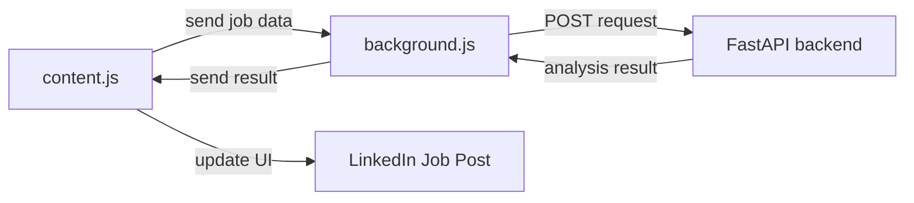

Perfect! Let’s break down the **final architecture of your AI Fake Job Detector Chrome extension + backend** in a clean, demo-ready way. I’ll explain it step by step so you can show it to anyone — judges, teammates, or even yourself in 2 months 😄.

---

# **Kiro AI Job Detector – Architecture Overview**

## 1️⃣ **User Interaction Layer (Chrome Extension)**

* **Where it lives:** In the user’s Chrome browser.
* **Main files:**

  * `content.js` → interacts with LinkedIn Jobs page (reads job posts, buttons, UI changes)
  * `popup.js` → handles popup UI (optional for manual job analysis)
  * `background.js` → acts as a bridge between content scripts and backend (service worker)
* **Responsibilities:**

  1. Detect job posts on LinkedIn.
  2. Send job metadata (title, company, URL, description) to `background.js`.
  3. Receive analysis result from `background.js` and display risk level in the UI.

> **Important:** Content scripts can’t directly make cross-origin network calls → background.js handles that.

---

## 2️⃣ **Background Script / Service Worker**

* **Where it runs:** Chrome’s **background service worker**.
* **Responsibilities:**

  1. Listen to messages from content scripts (`chrome.runtime.onMessage.addListener`).
  2. Send POST requests to the **FastAPI backend**.
  3. Receive backend analysis and relay it back to content.js.
* **Key concepts:**

  * `return true` in message listener → ensures async responses work.
  * Logs appear **only in the Service Worker console**, not LinkedIn page DevTools.

---

## 3️⃣ **Backend Layer (FastAPI)**

* **Where it runs:** Local server (`http://127.0.0.1:8000`) or deployed endpoint.
* **Responsibilities:**

  1. Receive JSON job data.
  2. Run AI-based analysis pipeline:

     * Feature extraction (company URL, job title, salary info)
     * ML / NLP model inference (hybrid: metadata + semantic text analysis)
     * Assign **risk score & flags** (e.g., “low”, “medium”, “high” risk)
  3. Return JSON response to background script.
* **Tech stack:**

  * Python 3.11+
  * FastAPI for REST API
  * Pydantic models for validation
  * ML/NLP models (Scikit-Learn + Transformers)
  * Optional: Uvicorn/Gunicorn for server

---

## 4️⃣ **Data Flow Summary**

1. **User opens LinkedIn Job post.**
2. **Content script** extracts job info → sends it to **background.js**.
3. **Background.js** logs “📡 Sending job to backend” → POSTs to FastAPI.
4. **FastAPI** receives request → runs ML/NLP model → returns `{riskLevel, score, flags}`.
5. **Background.js** logs “✅ Backend response” → sends result back to **content script**.
6. **Content script** updates UI → user sees risk level & flags directly on LinkedIn.

---

## 5️⃣ **Logging & Debugging (for Demo)**

| Component       | Logs appear in                  |
| --------------- | ------------------------------- |
| content.js      | LinkedIn page DevTools (F12)    |
| background.js   | Chrome Extension Service Worker |
| FastAPI backend | Terminal where server runs      |

> Always open Service Worker console to see real-time backend requests & responses.

---

## 6️⃣ **Tech Stack Summary**

| Layer               | Tech/Tools                                 |
| ------------------- | ------------------------------------------ |
| Chrome Extension UI | HTML, CSS, JS, Chrome APIs                 |
| Messaging Layer     | `chrome.runtime.sendMessage` + `onMessage` |
| Backend API         | Python FastAPI, Uvicorn                    |
| ML / NLP Models     | Scikit-Learn, Transformers (DistilBERT)    |
| Deployment / Local  | Localhost for dev, optional cloud for prod |

---

## 7️⃣ **Impact & Demo Highlights**

* ✅ Real-time job scam detection on LinkedIn
* ✅ Risk score & flags for immediate user insight
* ✅ Fully **full-stack pipeline**: content.js → background.js → backend → UI
* 🚀 Can scale to multiple users & job portals
* 🔧 Debug-friendly with separate console logging per layer

